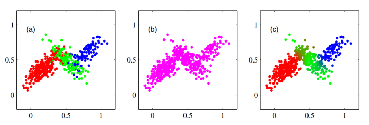
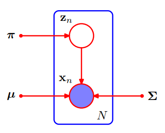
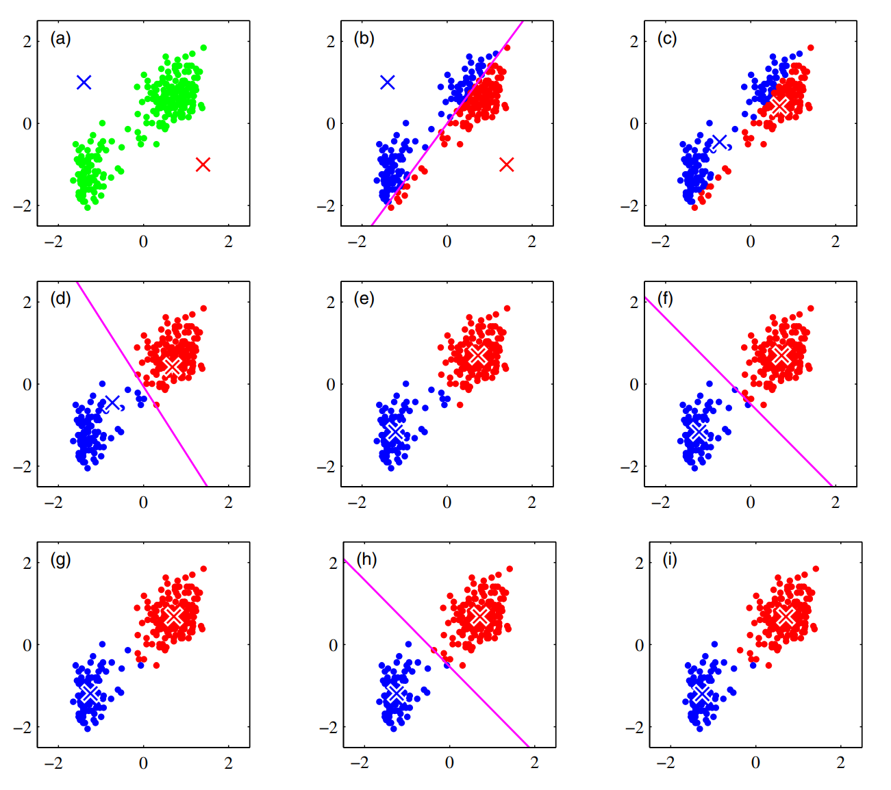
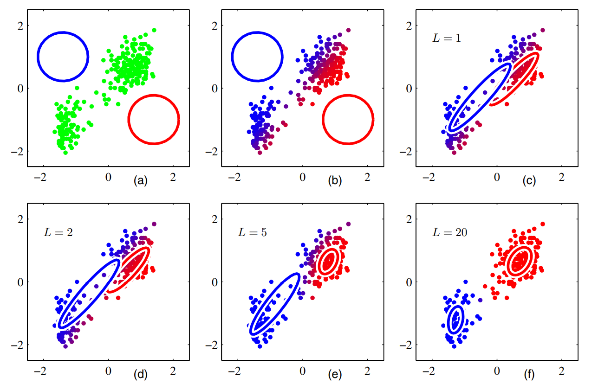

# EM笔记2

## 〇、一些说明

首发于知乎：
<https://zhuanlan.zhihu.com/p/431084480>。

Bishop的《Pattern Recognition and Machine Learning》（下面简称PRML）和李航的《统计学习方法》都介绍了EM（Expectation Maximization）算法。
这两本书给出了不同的推导方法，又都使用了Gaussian混合模型（Gaussian Mixture Model，GMM）作为例子。
这里给出详细推导及解释，并附上Python代码实现。

使用记号如下，与 PRML 基本一致：

* $\mathbf X = \{\pmb x_1, \cdots, \pmb x_N\}$：可观测变量的数据集
* $\mathbf Z = \{\pmb z_1, \cdots, \pmb z_N\}$：隐变量的数据集
* $\pmb\theta$：所有参数的集合
* $\mathbb E [\cdot]$：数学期望
* $p(\cdot)$：概率或概率密度

反复用到的概率论知识：

* 随机变量的函数的数学期望是以概率（密度）为权的加权和
    $$\mathbb{E}[g(z)] = \sum_z p(z)g(z)$$
* 联合概率是边缘概率和条件概率的乘积
    $$p(x, z) = p(x|z)p(z) = p(z|x)p(x)$$
* 联合概率求和得边缘概率
    $$p(z) = \sum_x p(x, z)$$

其中后两条被PRML反复强调，分别称为“product rule”和“sum rule”。

## 六、知识准备：Gaussian 混合模型

Gaussian Mixture Model，简称 GMM。EM算法的一个经典的例子就是其在 GMM中的应用，即 GMM-EM 算法。该算法求得 GMM 的最大似然解，并将其用于聚类。下面用两种不同的方式介绍 GMM，它们是相互等价的。

### （一）定义1

观测数据集记作 $\mathbf X = \{\pmb x_1,\cdots,\pmb x_N\}$，含有 $N$ 个 $D$ 维向量。

模型的参数如下，它们放在一起就是参数“集合” $\pmb\theta=(\pmb\mu,\mathbf\Sigma,\pmb\pi)$：

* $K$ 个均值 $\pmb\mu_1,\cdots, \pmb\mu_K$，都是 $D$ 维列向量，它们的集合记为 $\pmb\mu$。
* $K$ 个协方差矩阵 $\mathbf\Sigma_1,\cdots$, $\mathbf\Sigma_K$，都是 $D$ 行 $D$ 列矩阵，它们的集合记为 $\mathbf\Sigma$。
* 混合系数 $\pmb\pi = (\pi_1,\cdots,\pi_K)^{\rm T}$ ， $K$ 维列向量，非负，各元素之和为 $1$。

定义 GMM 的概率密度函数

$$
\begin{aligned}
p(\pmb x | \pmb\theta)
&= p(\pmb x | \pmb\mu, \mathbf\Sigma, \pmb\pi)\\
&= \sum_{k=1}^K \pi_k \mathcal N(\pmb x | \pmb\mu_k, \mathbf\Sigma_k)
\end{aligned}
$$

其中 $\forall k = 1,\cdots, K$，

$$
\mathcal N(\pmb x | \pmb\mu_k, \mathbf\Sigma_k)
= \cfrac{1}{(2\pi)^{D/2}} \cfrac{1}{|\mathbf\Sigma|^{1/2}} \exp \left\{-\cfrac12 (\pmb x - \pmb\mu_k)^{\rm T} \mathbf\Sigma^{-1} (\pmb x - \pmb\mu_k)\right\}
$$

是 $D$ 维 Gaussian 的概率密度函数。

### （二）定义2

引入隐变量。GMM 原本只是 $K$ 个不同分布加权求和得到一个新的分布。 现在把它们再次分开，分成 $K$ 个分量（components），并认为 $\pmb x$ 会“来自于”其中一个分量。用 one-hot 的隐变量 $\pmb z$ 来指示 $\pmb x$ 来自哪个分量。

采样时，先以混合系数 $\pmb\pi$ 为概率分布采样得到 $\pmb z$，再在对应的 Gaussian 分布中采样得到 $\pmb x$。这等价于直接从混合分布中采样得到 $\pmb x$。

每次采样得到观测变量 $\pmb x$，都会有对应的隐变量 $\pmb z$，于是采样 $N$ 次之后，隐变量也会组成一个集合 $\mathbf Z=\{\pmb z_1,\cdots,\pmb z_N\}$。

PRML 将 $\pmb z$ 定义为 one-hot 向量，或者说 “1-of-$K$” 向量：

$$
\pmb z=(z_1,\cdots,z_K)^{\rm T}
$$
在 $\pmb z$ 的各个元素中，一个元素是 $1$，指示 $\pmb x$ 所属类别，其余元素都是 $0$：

$$
\forall 1\le k\le K,
z_{k}=\begin{cases}
1, &\text{if}\ \pmb x\ \text{is from component}\ k\\
0, &\text{otherwise}
\end{cases}
$$

概率图模型如下，该图展示了观测变量、隐变量、参数之间的依赖关系：

隐变量 $\pmb z$ 的分布由参数 $\pmb\pi$ 决定：

$$
p(z_k=1 | \pmb\pi) = \pi_k\\ p(\pmb z | \pmb\pi) = \prod_{k=1}^K \pi_k^{z_k}
$$

$\pmb x$ 的分布由 $\pmb z, \pmb\mu, \mathbf\Sigma$ 共同决定：

$$
p(\pmb x | z_k=1, \pmb\mu_k, \mathbf \Sigma_k) = \mathcal N(\pmb x | \pmb\mu_k, \mathbf\Sigma_k)\\ p(\pmb x | \pmb z, \pmb\mu, \mathbf \Sigma) = \prod_{k=1}^K \mathcal N(\pmb x | \pmb\mu_k, \mathbf\Sigma_k)^{z_k}
$$

将 $p(\pmb z | \pmb\pi)$ 与 $p(\pmb x | \pmb z)$ 相乘，再关于 $\pmb z$ 求和，可以得到给定参数后， $\pmb x$ 的边缘分布 $p(\pmb x | \pmb\mu, \mathbf \Sigma, \pmb\pi)$。这样计算出来的结果与定义1一致。

## 七、GMM-EM 算法步骤总结

机器学习包括无监督学习；无监督学习包括聚类；GMM-EM 算法是一个聚类算法，它将 EM 算法应用于 GMM，适用于凸性数据的聚类。另一种适用于凸性数据聚类的算法是 $K$-means 算法。建议先去看 $K$-means 算法，有助于对此算法的直观理解。

GMM-EM 算法步骤总结如下：

1. 初始化参数 $\pmb\mu_k^{{\rm old}},\mathbf\Sigma_k^{{\rm old}}, \pi_k^{{\rm old}}\ (k=1,\cdots,K)$，这些参数的初值可以由 $K$-means 算法给定。

2. E step 更新后验分布
$$
\gamma_{nk}\gets \cfrac{\pi_k\mathcal N(\pmb x_n | \pmb\mu_k, \mathbf\Sigma_k)}{\sum_{j=1}^K \pi_j\mathcal N(\pmb x_n | \pmb\mu_j, \mathbf\Sigma_j)}\quad (n=1,\cdots,N;k=1,\cdots,K)
$$
3. M step 更新参数
$$
\begin{aligned}
\pmb\mu_k^{{\rm new}}&\gets \cfrac{1}{N_k} \sum_{n=1}^N \gamma_{nk} \pmb x_n\\
\mathbf\Sigma_k^{{\rm new}}&\gets \cfrac{1}{N_k} \sum_{n=1}^N \gamma_{nk} (\pmb x_n - \pmb\mu_k) (\pmb x_n - \pmb\mu_k)^{\rm T}\\
\pi_k^{{\rm new}}&\gets \cfrac{N_k}{N} \quad (k=1,\cdots,K) \end{aligned}
$$
4. 检查是否收敛，如果没有收敛，则令
$$
\begin{aligned}
\pmb\mu_k^{{\rm old}}&\gets\pmb\mu_k^{{\rm new}}\\
\mathbf\Sigma_k^{{\rm old}}&\gets\mathbf\Sigma_k^{{\rm new}}\\
\pi_k^{{\rm old}}&\gets\pi_k^{{\rm new}}\quad (k=1,\cdots,K)
\end{aligned}
$$
随后返回 E step。
其中定义了后验分布
$$
\gamma_{nk}=p(z_{nk}=1 | \pmb x_n)\quad (n=1,\cdots,N;k=1,\cdots,K)
$$
这里将其称为“责任（responsibility）” 。PRML 使用记号 $\gamma(z_{nk})$，显得复杂了一些。
还定义了各类别的“有效数量”
$$
N_k = \sum_{n=1}^N \gamma_{nk}\quad (k=1,\cdots,K)
$$
5. 使用EM算法求得 GMM 的最大似然解之后，可以更进一步，对每个 $\pmb x_n$，估计出它最可能来自哪个类别
$$
\hat{C}_n = \text{argmax}_k \gamma_{nk}
$$
至此完成了凸性数据的无监督聚类。

## 八、与 $K$-means 算法的关系

PRML 将 GMM-EM 与 $K$-means 算法联系起来，很方便直观理解，如图3、图4所示。
两者有对应的、类似的 E step 和 M step。
$K$-means 是“硬分配”，EM 是“软分配”。
$K$-means 更新参数时，各类只使用类内的点；而 GMM-EM 每次都使用所有点。
$K$-means 是 EM 的特殊情况。

## 九、GMM-EM 算法更新公式的推导

### （一）方法一（PRML 9.2.2节）

一副不知何为EM算法的样子，直接优化对数似然，最优解相互耦合，迭代重估计。但结果与优化下界 $\mathcal Q$ 一致。PRML 用这个例子引入EM算法。

先把对数似然写出来

$$
\ln p(\mathbf X | \pmb\mu, \mathbf \Sigma, \pmb\pi) = \sum_{n=1}^N \ln\left\{\sum_{k=1}^K \pi_k \mathcal N(\pmb x_n | \pmb\mu_k, \mathbf\Sigma_k)\right\}
$$

其中

$$
\mathcal N(\pmb x | \pmb\mu_k, \mathbf\Sigma_k) = \cfrac{1}{(2\pi)^{D/2}} \cfrac{1}{|\mathbf\Sigma_k|^{1/2}} \exp \left\{-\cfrac12 (\pmb x - \pmb\mu_k)^{\rm T} \mathbf\Sigma_k^{-1} (\pmb x - \pmb\mu_k)\right\}
$$

不用急着代进去。

**（i）** 关于 $\pmb\mu_k$ 最大化对数似然

令对数似然 $\ln p(\mathbf X | \pmb\mu, \mathbf \Sigma, \pmb\pi)$ 对 $\pmb\mu_k$ 偏导为零：

$$
\begin{aligned} \cfrac{\partial}{\partial \pmb\mu_k} \ln p(\mathbf X | \pmb\mu, \mathbf \Sigma, \pmb\pi)
&= \sum_{n=1}^N \cfrac{\pi_k}{\sum_{j=1}^K \pi_j \mathcal N(\pmb x_n | \pmb\mu_j, \mathbf\Sigma_j)} \cfrac{\partial\mathcal N(\pmb x_n | \pmb\mu_k, \mathbf\Sigma_k)}{\partial \pmb\mu_k}\\
&= -\sum_{n=1}^N \cfrac{\pi_k\mathcal N(\pmb x_n | \pmb\mu_k, \mathbf\Sigma_k)}{\sum_{j=1}^K \pi_j \mathcal N(\pmb x_n | \pmb\mu_j, \mathbf\Sigma_j)} \mathbf\Sigma_k^{-1} (\pmb x_n - \pmb\mu_k)\\
&= -\sum_{n=1}^N \gamma_{nk} \mathbf\Sigma_k^{-1} (\pmb x_n - \pmb\mu_k)\\
&= 0
\end{aligned}
$$

其中“责任” $\gamma_{nk}$ 是“自然”出现的。

$\mathbf\Sigma_k^{-1}$ 非奇异，齐次方程只有零解，得

$$
\sum_{n=1}^N \gamma_{nk} (\pmb x_n - \pmb\mu_k) = \sum_{n=1}^N \gamma_{nk} \pmb x_n - N_k \pmb\mu_k = 0
$$

解得

$$
\hat{\pmb\mu}_k = \cfrac{1}{N_k} \sum_{n=1}^N \gamma_{nk} \pmb x_n
$$

直观解释：它是所有数据点的加权和（质心），以第 $k$ 类的“责任”  $\gamma_{nk}$ 为权（质量）。

**（ii）** 关于 $\mathbf\Sigma_k$ 最大化对数似然

该步必须在更新 $\pmb\mu_k$ 之后。令对数似然 $\ln p(\mathbf X | \pmb\mu, \mathbf \Sigma, \pmb\pi)$ 对 $\mathbf\Sigma_k$ 偏导为零：

$$
\begin{aligned}
\cfrac{\partial}{\partial\mathbf\Sigma_k} \ln p(\mathbf X | \pmb\mu, \mathbf\Sigma, \pmb\pi)
&= \sum_{n=1}^N \cfrac{\pi_k}{\sum_{j=1}^K \pi_j \mathcal N(\pmb x_n | \pmb\mu_j, \mathbf\Sigma_j)} \cfrac{\partial\mathcal N(\pmb x_n | \pmb\mu_k, \mathbf\Sigma_k)}{\partial \mathbf\Sigma_k}\\
&= \sum_{n=1}^N \cfrac{\pi_k\mathcal N(\pmb x_n | \pmb\mu_k, \mathbf\Sigma_k)}{\sum_{j=1}^K \pi_j \mathcal N(\pmb x_n | \pmb\mu_j, \mathbf\Sigma_j)} \cfrac{\partial \ln \mathcal N(\pmb x_n | \pmb\mu_k, \mathbf\Sigma_k)}{\partial \mathbf\Sigma_k}\\
&= \sum_{n=1}^N \gamma_{nk}\left(\cfrac12 \mathbf\Sigma_k - \cfrac12 (\pmb x_n - \pmb\mu_k)(\pmb x_n - \pmb\mu_k)^{\rm T}\right)\\
&= 0
\end{aligned}
$$

其中“责任” $\gamma_{nk}$ 又是“自然”出现的。 解得

$$
\hat{\mathbf\Sigma}_k = \cfrac{1}{N_k} \sum_{n=1}^N \gamma_{nk} (\pmb x_n - \pmb\mu_k) (\pmb x_n - \pmb\mu_k)^{\rm T}
$$

**（iii）** 关于 $\pi_k$ 最大化对数似然

这是有限制的优化，使用 Lagrange multipliers。PRML 只考虑了一个限制 $\sum_{k=1}^K \pi_k = 1$。

Lagrange 函数为

$$
\ln p(\mathbf X | \pmb\mu, \mathbf \Sigma, \pmb\pi) + \lambda\left(\sum_{k=1}^K\pi_k-1\right)
$$

令其对 $\pi_k$ 偏导为零：

$$
\sum_{n=1}^N \cfrac{\mathcal N(\pmb x_n | \pmb\mu_k, \mathbf\Sigma_k)}{\sum_{j=1}^K \pi_j \mathcal N(\pmb x_n | \pmb\mu_j, \mathbf\Sigma_j)} + \lambda = 0
$$

两边同乘 $\pi_k$ 再对 $k$ 求和，得

$$
\lambda=-N
$$

Lagrange 函数对 $\pi_k$ 偏导重新写为

$$
\sum_{n=1}^N \cfrac{\gamma_{nk}}{\pi_k}-N=\cfrac{N_k}{\pi_k}-N=0
$$

解得

$$
\hat{\pi}_k = \cfrac{N_k}{N}
$$

巧了，最优解满足了另一个限制 $\pi_k\ge 0$。

实际上，如果把这个限制也写进 Lagrange 函数，多一项 $-\sum_{k=1}^K \nu_k \pi_k$，偏导多一项 $-\nu_k$，那么令 $\lambda'=\lambda-\nu_k$，则接下来与 PRML 只考虑了一个限制的思路并无区别。

原本，在定义“责任” $\gamma_{nk}$ 之前，参数 $\pmb\mu,\mathbf\Sigma,\pmb\pi$ 的更新公式相互耦合，计算复杂。

定义 $\gamma_{nk}$ 之后，仍然有耦合，但方便分开，随后迭代轮流更新：

* $\gamma_{nk}$ 单独在 E step 更新；
* 参数在 M step 更新。参数之间其实还有耦合，更新 $\mathbf\Sigma$ 要用到 $\pmb\mu$，于是则按照惯例，先更新 $\pmb\mu$，后更新 $\mathbf\Sigma$。

### （二）方法二（PRML 9.3.1节，《统计学习方法》9.3节）

根据EM算法的定义，优化 $\mathcal Q(\pmb\theta,\pmb\theta^{{\rm old}})$，得参数更新公式。

**（i）** 先写出优化目标 $\mathcal Q(\pmb\theta,\pmb\theta^{{\rm old}})$ 的表达式。它是 $\ln p(\mathbf X,\mathbf Z | \pmb\mu,\mathbf\Sigma,\pmb\pi)$ 在估计的后验分布 $p(\mathbf Z | \mathbf X,\pmb\mu^{{\rm old}},\mathbf\Sigma^{{\rm old}},\pmb\pi^{{\rm old}})$ 下的数学期望。其中

$$
\begin{aligned}
p(\mathbf X,\mathbf Z | \pmb\mu,\mathbf\Sigma,\pmb\pi)
&= p(\mathbf X | \mathbf Z,\pmb\mu,\mathbf\Sigma,\pmb\pi) p(\mathbf Z | \pmb\mu,\mathbf\Sigma,\pmb\pi)\\
&= \prod_{n=1}^N \prod_{k=1}^K \pi_k^{z_{nk}} \mathcal N(\pmb x_n | \pmb\mu_k,\mathbf\Sigma_k)^{z_{nk}}
\end{aligned}
$$

取对数

$$
\ln p(\mathbf X,\mathbf Z | \pmb\mu,\mathbf\Sigma,\pmb\pi) = \sum_{n=1}^N \sum_{k=1}^K z_{nk} \left(\ln \pi_k + \ln \mathcal N(\pmb x_n | \pmb\mu_k,\mathbf\Sigma_k)\right)
$$

计算数学期望时，只有 $z_{nk}$ 会被平均，其他部分都是常数。

用 $\mathbb E_{\mathbf Z}$ 表示计算数学期望之前随机性在于 $\mathbf Z\sim p(\mathbf Z | \mathbf X,\pmb\mu^{{\rm old}},\mathbf\Sigma^{{\rm old}},\pmb\pi^{{\rm old}})$。

指示变量的数学期望就是概率

$$
\begin{aligned}
\mathbb E_{\mathbf Z}\left[z_{nk}\right]
&=p(z_{nk}=1 | \pmb x_n,\pmb\mu,\mathbf\Sigma,\pmb\pi)\\
&=\gamma_{nk}
\end{aligned}
$$

于是得到

$$
\begin{aligned}
\mathcal Q(\pmb\theta,\pmb\theta^{{\rm old}})
&=\mathbb E_{\mathbf Z}\left[\ln p(\mathbf X,\mathbf Z | \pmb\mu,\mathbf\Sigma,\pmb\pi)\right]\\
&=\sum_{n=1}^N \sum_{k=1}^K \gamma_{nk} \left(\ln \pi_k + \ln \mathcal N(\pmb x_n | \pmb\mu_k,\mathbf\Sigma_k)\right)\\ &= \sum_{k=1}^K N_{k}\ln \pi_k + \sum_{n=1}^N \sum_{k=1}^K \gamma_{nk} \ln \mathcal N(\pmb x_n | \pmb\mu_k,\mathbf\Sigma_k)
\end{aligned}
$$

**（ii）** 关于 $\pmb\mu_k$ 最大化 $\mathcal Q(\pmb\theta,\pmb\theta^{{\rm old}})$

令 $\mathcal Q(\pmb\theta,\pmb\theta^{{\rm old}})$ 对 $\pmb\mu_k$ 偏导为零：

$$
\begin{aligned}
\cfrac{\partial \mathcal Q(\pmb\theta,\pmb\theta^{{\rm old}})}{\partial \pmb\mu_k}
&= \cfrac{\partial}{\partial \pmb\mu_k} \sum_{n=1}^N \sum_{k=1}^K \gamma_{nk} \ln \mathcal N(\pmb x_n | \pmb\mu_k, \mathbf\Sigma_k)\\
&= \sum_{n=1}^N \sum_{k=1}^K \cfrac{\gamma_{nk}}{2}\mathbf\Sigma_k^{-1}(\pmb x_n - \pmb\mu_k)\\
&= 0
\end{aligned}
$$

解得

$$
\hat{\pmb\mu}_k = \cfrac{1}{N_k} \sum_{n=1}^N \gamma_{nk} \pmb x_n
$$

**（iii）** 关于 $\mathbf\Sigma_k$ 最大化 $\mathcal Q(\pmb\theta,\pmb\theta^{{\rm old}})$

令 $\mathcal Q(\pmb\theta,\pmb\theta^{{\rm old}})$ 对 $\mathbf\Sigma_k$ 偏导为零：

$$
\begin{aligned}
\cfrac{\partial \mathcal Q(\pmb\theta,\pmb\theta^{{\rm old}})}{\partial \mathbf\Sigma_k}
&= \cfrac{\partial}{\partial \mathbf\Sigma_k} \sum_{n=1}^N \sum_{k=1}^K \gamma_{nk} \ln \mathcal N(\pmb x_n | \pmb\mu_k, \mathbf\Sigma_k)\\
&= \sum_{n=1}^N \sum_{k=1}^K \gamma_{nk} \left(\cfrac12 \mathbf\Sigma_k - \cfrac12 (\pmb x_n - \pmb\mu_k)(\pmb x_n - \pmb\mu_k)^{\rm T}\right)\\
&= 0
\end{aligned}
$$

解得

$$
\hat{\mathbf\Sigma}_k = \cfrac{1}{N_k} \sum_{n=1}^N \gamma_{nk} (\pmb x_n - \pmb\mu_k) (\pmb x_n - \pmb\mu_k)^{\rm T}
$$

**（iv）** 关于 $\pmb\pi$ 最大化 $\mathcal Q(\pmb\theta,\pmb\theta^{{\rm old}})$

Lagrange 函数

$$
\sum_{k=1}^K N_{k} \ln \pi_k + \lambda\left(\sum_{k=1}^K\pi_k-1\right)
$$

令 Lagrange 函数对 $\pi_k$ 偏导为零，得

$$
\cfrac{N_k}{\pi_k}+\lambda=0
$$

乘 $\pi_k$ 再对 $k$ 求和

$$
N + \lambda=0\\ \lambda=-N
$$

解得

$$
\hat{\pi}_k = \cfrac{N_k}{N}
$$

两种方法结果相同。
  
## 十、其他

1. PRML 认为，由于 GMM-EM 收敛过慢，一般先使用 $K$-means 算法得到参数的初值。
2. 《统计学习方法》认为，由于 EM 算法对参数初值敏感，一般“选取几个不同的初值进行迭代，然后对得到的各个估计值加以比较，从中选择最好的”。
3. PRML 给了还给了另外两个例子：mixtures of Bernoulli distributions（9.3.3节），EM for Bayesian linear regression（9.3.4节）。
4. 《统计学习方法》9.4节介绍了EM算法的推广：F函数的极大-极大算法（maximization-maximization algorithm）。

## 参考资料

[1] Bishop, Christopher M. Pattern Recognition and Machine Learning. New York: Springer, 2006.

[2] 李航.统计学习方法 [M].北京.清华大学出版社,2019.
