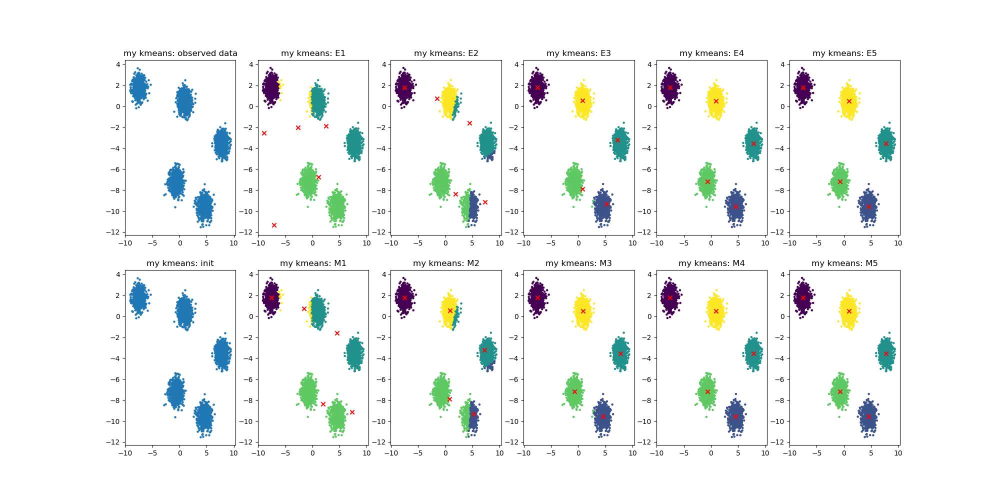
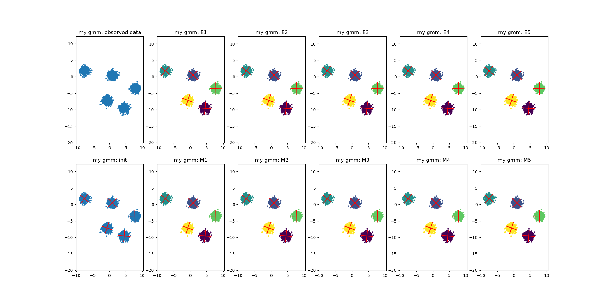
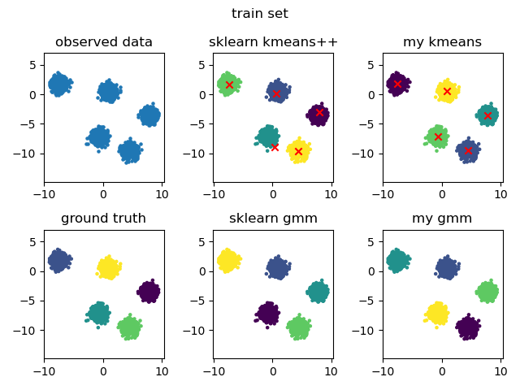
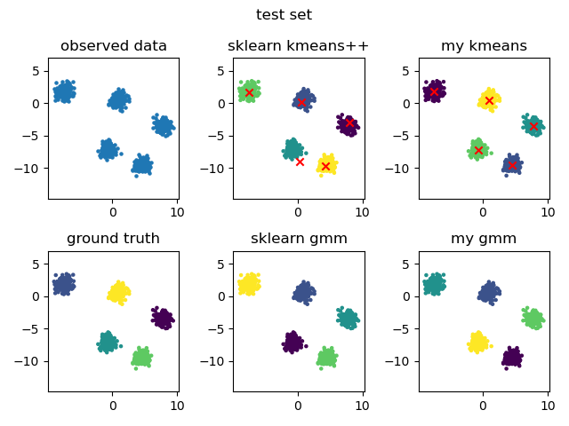
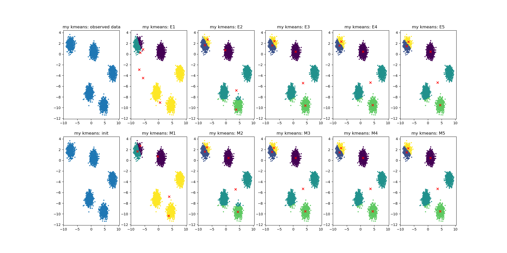
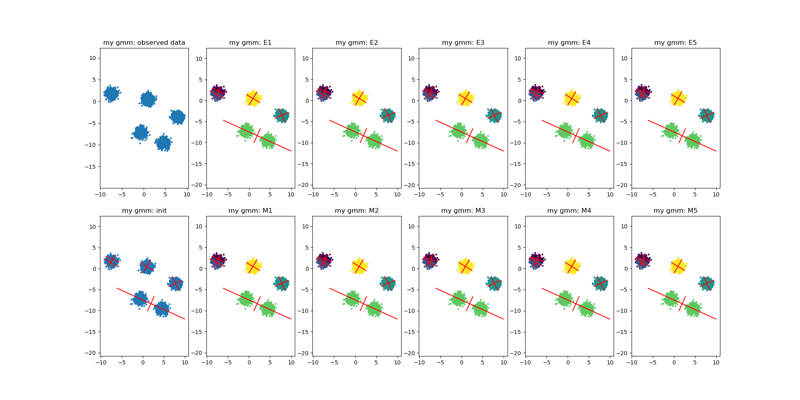
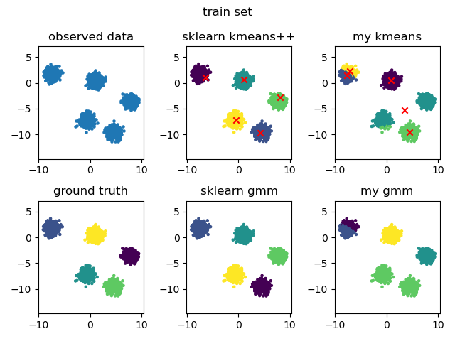
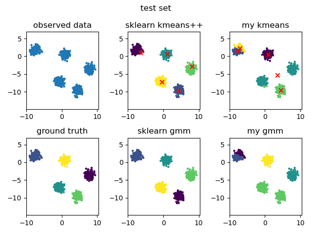

# K-means and GMM-EM

用Python实现用于聚类的K-means算法和EM算法，将训练过程可视化，并与sklearn对比。

## 使用环境

```shell
python 3.9.12
numpy 1.21.5
matplotlib 3.5.1
scikit-learn 1.0.2
```

## 结果

### 一次较好的结果

K-means算法训练过程



EM算法训练过程



训练集结果



测试集结果



训练得比较好，看起来甚至比sklearn更接近中心。

### 一次较差的结果

K-means算法训练过程



EM算法训练过程



训练集结果



测试集结果



训练得比较差，可能是陷入了局部极小，或许需要更好的初值。
