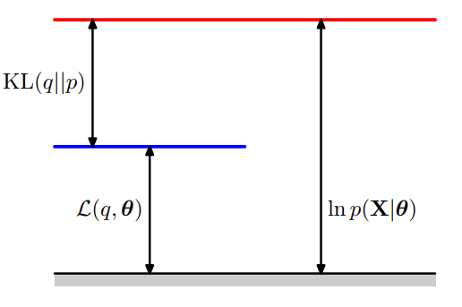
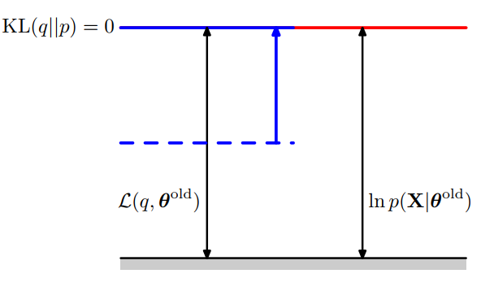

# EM笔记1

## 〇、一些说明

2022.2.20更新。首发于知乎：
<https://zhuanlan.zhihu.com/p/423524261>。

使用记号如下，与 PRML 基本一致：

* $\mathbf X = \{\pmb x_1, \cdots, \pmb x_N\}$：可观测变量的数据集
* $\mathbf Z = \{\pmb z_1, \cdots, \pmb z_N\}$：隐变量的数据集
* $\pmb\theta$：所有参数的集合
* $\mathbb E [\cdot]$：数学期望
* $p(\cdot)$：概率或概率密度

看一些又长又复杂的公式时，容易忘记的概率论基础知识：

* 随机变量的函数的数学期望是以概率或概率密度函数为权的加权和
* 联合 = 边缘 × 条件
* 联合 -- 积分（求和）--> 边缘

其中后两条几乎被 PRML 奉为圭臬，分别称为“product rule”和“sum rule”，在1.2节帮读者复习概率论时专门列出来强调。

## 一、EM算法的作用

用于含有隐变量的概率模型，求最大似然解。它是机器学习领域的经典算法。

## 二、EM算法步骤总结（见于 PRML 9.3节）

>1. 初始化 $\pmb\theta^{{\rm old}}$
>2. **E step**：计算后验概率分布 $p(\mathbf Z | \mathbf X, \pmb\theta^{{\rm old}})$
>3. **M step**：更新参数 $\pmb\theta^{{\rm new}} = \text{argmax}_{\pmb\theta} \mathcal Q(\pmb\theta, \pmb\theta^{{\rm old}})$
>4. 检查是否收敛，如未收敛则令 $\pmb\theta^{{\rm old}} \gets \pmb\theta^{{\rm new}}$，随后返回步骤2

其中定义了

$$
\begin{aligned}
\mathcal Q(\pmb\theta, \pmb\theta^{{\rm old}})
&\triangleq \sum_{\mathbf Z} p(\mathbf Z | \mathbf X, \pmb\theta^{{\rm old}}) \ln p(\mathbf X, \mathbf Z | \pmb\theta)\\
&= \mathbb E_{\mathbf Z} [\ln p(\mathbf X, \mathbf Z | \pmb\theta)]
\end{aligned}
$$

一些说明如下：

* 注1：E step 的另一种说法（《统计学习方法》9.1.1节）是计算 $\mathcal Q(\pmb\theta, \pmb\theta^{{\rm old}})$，这两种说法差别不大，因为 $\mathcal Q(\pmb\theta, \pmb\theta^{{\rm old}})$ 表达式中含有后验概率 $p(\mathbf Z | \mathbf X, \pmb\theta^{{\rm old}})$。
* 注2：$\mathcal Q(\pmb\theta, \pmb\theta^{{\rm old}})$ 是对数似然 $\ln p(\mathbf  X | \pmb\theta)$ 的下界。（在第三、四部分证明）
* 注3：优化下界 $\mathcal Q(\pmb\theta, \pmb\theta^{{\rm old}})$ 会有优化对数似然的效果。（在第三、四部分证明）
* 注4：优化 $\mathcal Q(\pmb\theta, \pmb\theta^{{\rm old}})$ 比优化对数似然更简单。理由如下：
$p(\mathbf X|\pmb\theta)$ 被称为不完全数据集 $\mathbf X$ 的似然， $p(\mathbf X, \mathbf Z | \pmb\theta)$ 被称为完全数据集 $\{\mathbf X, \mathbf Z\}$ 的似然，尽管这种称谓与EM算法的关联并不明显。它们之间的关系是，联合分布求和（积分）可得边缘分布：
$$
p(\mathbf X | \pmb\theta) = \sum_{\mathbf Z} p(\mathbf X, \mathbf Z | \pmb\theta)
$$
在含有隐变量的概率模型中，往往是先写出联合分布，再像这样求和（积分）得到边缘分布。两边同取对数，得
$$
\ln p(\mathbf X | \pmb\theta) = \ln \left(\sum_{\mathbf Z} p(\mathbf X, \mathbf Z | \pmb\theta)\right)
$$
这就是原本需要最大化的对数似然的表达式，但对数内有求和，不方便求导、优化。而在下界 $\mathcal Q(\pmb\theta, \pmb\theta^{{\rm old}})$ 的表达式中，对数内没有求和，方便求导、优化。

## 三、EM算法的正确性（PRML 版本）

主要问题： $\mathcal Q(\pmb\theta, \pmb\theta^{{\rm old}})$ 为什么是对数似然的下界？它是从何而来的？优化它为什么会达到优化对数似然的效果？

### （一）下界 $\mathcal Q(\pmb\theta, \pmb\theta^{{\rm old}})$ 从何而来（见于9.3节）

书中提到，与其优化对数似然，不如优化它的下界。一通放缩就得到了下界 $\mathcal Q(\pmb\theta, \pmb\theta^{{\rm old}})$。

（A）简略版：

$$
\begin{aligned}
\ln p(\mathbf X | \pmb\theta)
&= \ln\left(\sum_{\mathbf Z} p(\mathbf X, \mathbf Z | \pmb\theta)\right)\\ &\ge \ln \mathbb E_{\mathbf Z} [p(\mathbf X, \mathbf Z | \pmb\theta)]\\
&\ge \mathbb E_{\mathbf Z} \left[\ln p(\mathbf X, \mathbf Z | \pmb\theta)\right]\\
&= \mathcal Q(\pmb\theta, \pmb\theta^{{\rm old}})
\end{aligned}
$$

其中第二个不等号是 Jensen's inequality。关于 $\mathbf Z$ 求期望时，使用估计的后验概率 $p(\mathbf Z | \mathbf X,\pmb\theta^{{\rm old}})$，即

$$
\begin{aligned}
\mathbb E_{\mathbf Z} [f(\mathbf Z)]
&\triangleq \mathbb E_{\mathbf Z\sim p\left(\mathbf Z | \mathbf X,\pmb\theta^{{\rm old}}\right)} [f(\mathbf Z)]\\
&= \sum_{\mathbf Z} p(\mathbf Z | \mathbf X,\pmb\theta^{{\rm old}}) f(\mathbf Z)
\end{aligned}
$$

（B）详细版：

首先写出对数似然的表达式

$$
\ln p(\mathbf X | \pmb\theta) = \ln\left(\sum_{\mathbf Z} p(\mathbf X, \mathbf Z | \pmb\theta)\right)
$$

这一步使用了“sum rule”，即边缘分布等于联合分布的求和。这是给定含有隐变量的概率模型后，计算对数似然所用的表达式。当然，它并不方便直接优化，因为求导复杂。

接着做一步放缩

$$
\ln\left(\sum_{\mathbf Z} p(\mathbf X, \mathbf Z | \pmb\theta)\right)\ge \ln\left(\sum_{\mathbf Z} p(\mathbf Z | \mathbf X,\pmb\theta^{{\rm old}}) p(\mathbf X, \mathbf Z | \pmb\theta)\right)
$$

这一步成立是因为 $p(\mathbf Z | \mathbf X,\pmb\theta^{{\rm old}})\le 1$ （隐变量 $\mathbf Z$ 是离散的，此处 $p$ 是概率）。不等号右侧对数内的是随机变量 $\mathbf Z$ 的函数 $p(\mathbf X, \mathbf Z | \pmb\theta)$ 以概率分布 $p(\mathbf Z | \mathbf X, \pmb\theta^{{\rm old}})$ 为权的加权和，也就是该函数的数学期望

$$
\ln\left(\sum_{\mathbf Z} p(\mathbf Z | \mathbf X,\pmb\theta^{{\rm old}}) p(\mathbf X, \mathbf Z | \pmb\theta)\right) = \ln \mathbb E_{\mathbf Z} [p(\mathbf X, \mathbf Z | \pmb\theta)]
$$

由于对数是一个凹函数，根据Jensen's inequality可以得到，期望的对数大于等于对数的期望：

$$
\ln \mathbb E[\varphi(\mathbf Z)]\ge \mathbb E[\ln\varphi(\mathbf Z)]
$$

应用到上式，得

$$
\begin{aligned}
\ln \mathbb E_{\mathbf Z}[p(\mathbf X, \mathbf Z | \pmb\theta)]
&\ge \mathbb E_{\mathbf Z}[\ln p(\mathbf X, \mathbf Z | \pmb\theta)]\\
&= \mathcal Q(\pmb\theta,\pmb\theta^{\rm old})
\end{aligned}
$$

下界 $\mathcal Q(\pmb\theta,\pmb\theta^{\rm old})$ 正是在这里定义出来的。当然，可以把数学期望再展开写成求和的形式

$$
\begin{aligned}
\mathcal Q(\pmb\theta,\pmb\theta^{\rm old})
&= \mathbb E_{\mathbf Z}[\ln p(\mathbf X, \mathbf Z | \pmb\theta)]\\
&= \sum_{\mathbf Z} p(\mathbf Z | \mathbf X,\pmb\theta^{{\rm old}}) \ln p(\mathbf X, \mathbf Z | \pmb\theta)
\end{aligned}
$$

由此可见 $\mathcal Q$ 是对数似然的下界。

这一段并没有说明优化下界 $\mathcal Q$ 为什么能达到优化对数似然的效果。

### （二）优化下界 $\mathcal Q(\pmb\theta, \pmb\theta^{{\rm old}})$ 为何会有优化对数似然的效果（见于9.4节）

将对数似然 $\ln p(\mathbf X | \pmb\theta)$ 分解为下界（ELBO） $\mathcal L(q,\pmb\theta)$ 与KL散度 $\text{KL}(q||p)$ 之和。E step 计算后验概率分布其实是令 $q(\mathbf Z)=p(\mathbf Z | \pmb\theta^{{\rm old}})$，使得 $\text{KL} (q||p)$ 减小至 $0$，同时下界 $\mathcal L(q,\pmb\theta)$ 增大至对数似然；M step 最大化 $\mathcal Q(\pmb\theta, \pmb\theta^{{\rm old}})$，使得 $\mathcal L(q,\pmb\theta), \text{KL}(q||p)$ 和 $\mathcal Q(\pmb\theta, \pmb\theta^{{\rm old}})$ 全部增大。

下面分5个部分详细介绍：

* part 1：对数似然分解及两个泛函的定义与性质
* part 2：对数似然分解的证明
* part 3：E step、M step的新的定义
* part 4：更新过程的详细描述
* part 5：总结

**part 1**：对数似然分解的定义

对任意分布 $q(\mathbf Z)$，都有

$$
\ln p(\mathbf X | \pmb\theta) = \mathcal L(q, \pmb\theta) + \text{KL}(q||p)
$$

这里定义了两个泛函

$$
\begin{aligned}
\mathcal L(q, \pmb\theta)
&\triangleq \mathbb E_{\mathbf Z} \left[\ln \left(\cfrac{p(\mathbf X, \mathbf Z | \pmb\theta)}{q(\mathbf Z)}\right)\right]\\
&= \sum_{\mathbf Z} q(\mathbf Z) \ln \left( \cfrac{p(\mathbf X, \mathbf Z | \pmb\theta)}{q(\mathbf Z)}\right) \end{aligned}
$$

$$
 \begin{aligned}
 \text{KL}(q||p)
 &\triangleq \mathbb E_{\mathbf Z} \left[\ln \left(\cfrac{q(\mathbf Z)}{p(\mathbf X | \mathbf Z, \pmb\theta)}\right)\right]\\
 &= -\sum_{\mathbf Z} q(\mathbf Z) \ln \left(\cfrac{p(\mathbf X | \mathbf Z, \pmb\theta)}{q(\mathbf Z)} \right)\end{aligned}
 $$

其中，KL散度非负：

$$
\text{KL}(q||p)\ge 0
$$

等号成立当且仅当 $q=p$。

可见 $\mathcal L(q, \pmb\theta)$ 是对数似然的下界：

$$
\mathcal L(q, \pmb\theta) \le \ln p(\mathbf X | \pmb\theta)
$$

等号成立当且仅当 $q=p$。

**part 2**：对数似然分解的证明

$$
\begin{aligned}
\ln p(\mathbf X | \pmb\theta)
&= \mathbb E_{\mathbf Z} [\ln p(\mathbf X | \pmb\theta)]\\
&= \mathbb E_{\mathbf Z} \left[\ln \left( \cfrac{p(\mathbf X, \mathbf Z | \pmb\theta)}{p(\mathbf X | \mathbf Z, \pmb\theta)}\right)\right]\\
&= \mathbb E_{\mathbf Z} \left[\ln \left(\cfrac{p(\mathbf X, \mathbf Z | \pmb\theta)}{q(\mathbf Z)} \cfrac{q(\mathbf Z)}{p(\mathbf X | \mathbf Z, \pmb\theta)}\right)\right]\\
&= \mathbb E_{\mathbf Z} \left[\ln \left(\cfrac{p(\mathbf X, \mathbf Z | \pmb\theta)}{q(\mathbf Z)}\right)\right] + \mathbb E_{\mathbf Z} \left[\ln \left(\cfrac{q(\mathbf Z)}{p(\mathbf X | \mathbf Z, \pmb\theta)}\right)\right]\\
&\triangleq \mathcal L(q, \pmb\theta) + \text{KL}(q||p)
\end{aligned}
$$

其中，关于 $\mathbf Z$ 求期望时，使用一个任意的分布 $q(\mathbf Z)$：

$$
\begin{aligned} \mathbb E_{\mathbf Z} [f(\mathbf Z)] &\triangleq \mathbb E_{\mathbf Z\sim q(\mathbf Z)} [f(\mathbf Z)]\\ &= \sum_{\mathbf Z} q(\mathbf Z) f(\mathbf Z) \end{aligned}
$$

文字解释：

* 第一行： $\ln p(\mathbf X | \pmb\theta)$ 是 $\mathbf X$ 的边缘分布，与 $\mathbf Z$ 无关；
* 第二行：“product rule”，联合分布是边缘分布与条件分布的乘积；
* 第三行：一乘一除，便于分解；
* 第四行：先使用对数运算性质，乘积变为加和，再使用期望的线性性；
* 第五行：就是定义。

**part 3**：E step、M step的新的定义

将 $q(\mathbf Z)$ 视作对后验分布 $p\left(\mathbf Z | \mathbf X, \pmb\theta\right)$ 的估计。

>**E step**：固定 $\pmb\theta^{{\rm old}}$ ，更新 $q(\mathbf Z)$。关于 $q(\mathbf Z)$ 最大化 $\mathcal L(q, \pmb\theta^{{\rm old}})$，得最优解 $q(\mathbf Z) = p(\mathbf Z | \mathbf X, \pmb\theta^{{\rm old}})$。
>**M step**：固定 $q(\mathbf Z)$ ，更新 $\pmb \theta$。关于 $\pmb\theta$ 最大化 $\mathcal L(q, \pmb\theta)$，最优解 $\pmb\theta^{{\rm new}}$ 因模型而异。

**part 4**：更新过程的详细描述

先回忆一下对数似然分解

$$
\ln p(\mathbf X | \pmb\theta) = \mathcal L(q, \pmb\theta) + \text{KL}(q||p)
$$

以及KL散度的性质

$$
\text{KL}(q||p)\ge 0
$$

等号成立当且仅当 $q=p$。

可以将KL散度视作从下界 $\mathcal L$ 到对数似然的“距离”。起初，此“距离”为正，如图1所示。

**E step**：固定 $\pmb\theta^{{\rm old}}$，更新 $q(\mathbf Z)$。关于 $q(\mathbf Z)$ 最大化下界 $\mathcal L$：

$$
\max_{q} \mathcal L(q, \pmb\theta^{{\rm old}})
$$

虽然是变分最优化，但可以用KL散度一步到位。最优解应满足 $\text{KL}(q||p) = 0$，于是得到

$$
q(\mathbf Z) = p(\mathbf Z | \mathbf X, \pmb\theta^{{\rm old}})
$$

此时，如图2所示，KL散度这一“距离”被“弥合”，下界 $\mathcal L$ 增大至旧参数 $\pmb\theta^{{\rm old}}$ 下的对数似然，或者说“赶上”了对数似然

$$
\mathcal L\left(q, \pmb\theta^{{\rm old}}\right) = \ln p(\mathbf X | \pmb\theta^{{\rm old}})
$$

顺带一提，此时 $\mathcal L(q, \pmb\theta)$ 和 $\mathcal Q(\pmb\theta, \pmb\theta^{{\rm old}})$ 只相差一个与 $\pmb\theta$ 无关的常数项，并且此常数项是 $q(\mathbf Z)$ 的负熵

$$
\mathcal L(q, \pmb\theta) = \mathcal Q(\pmb\theta, \pmb\theta^{{\rm old}}) - \mathbb E_{\mathbf Z} [\ln q(\mathbf Z)]
$$

以上就是 E step 所做的。

**M step**：固定 $q(\mathbf Z)$，更新 $\pmb \theta$。关于 $\pmb\theta$ 最大化 $\mathcal L(q, \pmb\theta)$：

$$
\max_{\pmb\theta} \mathcal L(q, \pmb\theta)
$$

忽略常数项，则此优化问题等价于

$$
\max_{\pmb\theta} \mathcal Q(\pmb\theta, \pmb\theta^{{\rm old}})
$$

可见与先前定义的优化问题一致。如无限制，则直接求导，令导数为零；如有限制，则使用 Lagrange multipliers，得最优解 $\pmb\theta^{{\rm new}}$。

此时，虽然下界 $\mathcal L$ 增大了，但由于参数更新，$q(\mathbf Z) < p(\mathbf Z | \mathbf X, \pmb\theta^{\rm new})$，KL散度大于零，对数似然也增大了，并且增大得更多，再次“甩开”下界 $\mathcal L$，回到了如图1所示的状态：

$$
\ln p(\mathbf X | \pmb\theta^{{\rm new}})>\mathcal L(q, \pmb\theta^{{\rm old}})
$$

以上就是 M step 所做的。

**part 5**：总结

可见，E step 和 M step 都使下界 $\mathcal L$ 增大，而 M step 还使对数似然增大。这证明了EM算法每次迭代都使对数似然增大。另外，这里提到的泛函和变分优化的方法与 PRML 下一章衔接紧密。

## 四、EM算法的正确性（《统计学习方法》版本）

主要问题： $\mathcal Q(\pmb\theta, \pmb\theta^{(i)})$ 为什么是对数似然的下界？它是从何而来的？优化它为什么会达到优化对数似然的效果？
说明：记号与原文有所不同，在加粗、花体、大小写等方面与 PRML 保持一致。

### （一）方法一（见于9.1.2节）

希望极大化对数似然

$$
\begin{aligned} L(\pmb\theta) &= \ln p(\mathbf X | \pmb\theta)\\ &= \ln \sum_{\mathbf Z} p(\mathbf X, \mathbf Z | \pmb\theta)\\ &= \ln \left(\sum_{\mathbf Z} p(\mathbf X | \mathbf Z, \pmb\theta) p(\mathbf Z | \pmb\theta)\right) \end{aligned}
$$

EM算法通过迭代逐步近似极大化对数似然。设第 $i$ 次迭代后参数估计值为 $\pmb\theta^{(i)}$，希望新估计值 $\pmb\theta$ 能使 $L(\pmb\theta)$ 增加，即 $L(\pmb\theta)>L(\pmb\theta^{(i)})$，并逐步达到极大值。

为此，考虑两者的差，并利用Jensen's inequality得到其下界

$$
\begin{aligned}
L(\pmb\theta) - L(\pmb\theta^{(i)}) &= \ln\left( \sum_{\mathbf Z} p(\mathbf X | \mathbf Z, \pmb\theta) p(\mathbf Z | \pmb\theta) \right) - \ln p(\mathbf X | \pmb\theta^{(i)})\\
&= \ln\left( \sum_{\mathbf Z} p(\mathbf Z | \mathbf X, \pmb\theta) \cfrac {p(\mathbf X | \mathbf Z, \pmb\theta) p(\mathbf Z | \pmb\theta)} {p(\mathbf Z | \mathbf X, \pmb\theta)} \right) - \ln p(\mathbf X | \pmb\theta^{(i)})\\
&\ge \sum_{\mathbf Z} p(\mathbf Z | \mathbf X, \pmb\theta) \ln\cfrac {p(\mathbf X | \mathbf Z, \pmb\theta) p(\mathbf Z | \pmb\theta)} {p(\mathbf Z | \mathbf X, \pmb\theta)} - \ln p(\mathbf X | \pmb\theta^{(i)})\\
&= \sum_{\mathbf Z} p(\mathbf Z | \mathbf X, \pmb\theta) \ln\cfrac {p(\mathbf X | \mathbf Z, \pmb\theta) p(\mathbf Z | \pmb\theta)} {p(\mathbf Z | \mathbf X, \pmb\theta) p(\mathbf X | \pmb\theta^{(i)})}\\ &\triangleq B\left(\pmb\theta, \pmb\theta^{(i)}\right) - L(\pmb\theta^{(i)})
\end{aligned}
$$

可见 $B(\pmb\theta, \pmb\theta^{(i)})$ 是对数似然 $L(\pmb\theta)$ 的下界

$$
L(\pmb\theta)\ge B(\pmb\theta, \pmb\theta^{(i)})
$$

并且

$$
L(\pmb\theta^{(i)})=B(\pmb\theta^{(i)}, \pmb\theta^{(i)})
$$

因此，任何可以使 $B(\pmb\theta, \pmb\theta^{(i)})$ 增大的 $\pmb\theta$，也可以使 $L(\pmb\theta)$ 增大。于是可以转而优化 $B(\pmb\theta, \pmb\theta^{(i)})$：

$$
\pmb\theta^{(i+1)}=\text{argmax}_{\pmb\theta} B(\pmb\theta, \pmb\theta^{(i)})
$$

$B(\pmb\theta, \pmb\theta^{(i)})$ 一通变形，省略常数项，此优化问题等价于

$$
\pmb\theta^{(i+1)}=\text{argmax}_{\pmb\theta}\mathcal Q(\pmb\theta, \pmb\theta^{(i)})
$$

与 PRML 比较：

* 此处的 $B(\pmb\theta, \pmb\theta^{(i)})$ 正是ELBO，即 PRML 定义的 $\mathcal L(q, \pmb\theta^{(i)})$，其中 $q(\mathbf Z)=p(\mathbf Z | \mathbf X, \pmb\theta^{(i)})$。
* 将 $L(\pmb\theta)$ 和 $L(\pmb\theta^{(i)})$ 作差其实显得有些多余。非要说的话，或许这样便于得到 $B(\pmb\theta, \pmb\theta^{(i)})$。
* 推导时没有提到泛函，这一点显得比 PRML 更为亲民。
* 这一段不仅证明了 $\mathcal Q(\pmb\theta, \pmb\theta^{(i)})$ 是对数似然的下界，而且还成功说明了优化下界 $\mathcal Q(\pmb\theta, \pmb\theta^{(i)})$ 为什么能达到优化对数似然的效果。

### （二）方法二（见于9.2节）

定理9.1：设 $p(\mathbf X | \pmb\theta)$ 为观测数据的似然函数，$\pmb\theta^{(i)}(i=1,2,\cdots)$ 为EM算法得到的参数估计序列， $p(\mathbf X | \pmb\theta^{(i)})(i=1,2,\cdots)$ 为对应的似然函数序列，则 $p(\mathbf X | \pmb\theta^{(i)})$ 是单调递增的，即

$$
p(\mathbf X | \pmb\theta^{(i+1)})\ge p(\mathbf X | \pmb\theta^{(i)})
$$

证明：由于

$$
p(\mathbf X | \pmb\theta)=\cfrac{p(\mathbf X, \mathbf Z | \pmb\theta)}{p(\mathbf Z | \mathbf X, \pmb\theta)}
$$

取对数有

$$
\log p(\mathbf X | \pmb\theta)=\log p(\mathbf X, \mathbf Z | \pmb\theta) - \log p(\mathbf Z | \mathbf X, \pmb\theta)
$$

根据定义

$$
\mathcal Q(\pmb\theta, \pmb\theta^{(i)}) = \sum_{\mathbf Z} p(\mathbf Z | \mathbf X, \pmb\theta^{(i)}) \log p(\mathbf X, \mathbf Z | \pmb\theta)
$$

令

$$
H(\pmb\theta, \pmb\theta^{(i)}) = \sum_{\mathbf Z} p(\mathbf Z | \mathbf X, \pmb\theta^{(i)}) \log p(\mathbf Z | \mathbf X, \pmb\theta)
$$

于是对数似然函数可以写成

$$
\log p(\mathbf X | \pmb\theta) = \mathcal Q(\pmb\theta, \pmb\theta^{(i)}) - H(\pmb\theta, \pmb\theta^{(i)})
$$

在上式中取 $\pmb\theta$ 为 $\pmb\theta^{(i+1)}$ 和 $\pmb\theta^{(i)}$ 并相减，得

$$
\begin{aligned}
\log p(\mathbf X | \pmb\theta^{(i+1)}) - \log p(\mathbf X | \pmb\theta^{(i)})
&= \left(\mathcal Q(\pmb\theta^{(i+1)}, \pmb\theta^{(i)}) - \mathcal Q(\pmb\theta^{(i)}, \pmb\theta^{(i)})\right)\\
&\quad - \left(H(\pmb\theta^{(i+1)}, \pmb\theta^{(i)}) - H(\pmb\theta^{(i)}, \pmb\theta^{(i)})\right) \end{aligned}
$$

只需证上式右端是非负的。第1项，由于 $\pmb\theta^{(i+1)}$ 使 $\mathcal Q(\pmb\theta, \pmb\theta^{(i)})$ 达到极大，所以有

$$
\mathcal Q(\pmb\theta^{(i+1)}, \pmb\theta^{(i)}) - \mathcal Q(\pmb\theta^{(i)}, \pmb\theta^{(i)}) \ge 0
$$

第2项，由Jensen's inequality得

$$
\begin{aligned}
H(\pmb\theta^{(i+1)}, \pmb\theta^{(i)}) - H(\pmb\theta^{(i)}, \pmb\theta^{(i)})
&= \sum_{\mathbf Z} p(\mathbf Z | \mathbf X, \pmb\theta^{(i)}) \log \cfrac{p(\mathbf Z | \mathbf X, \pmb\theta^{(i+1)})}{p(\mathbf Z | \mathbf X, \pmb\theta^{(i)})}\\
&\le \log \sum_{\mathbf Z} p(\mathbf Z | \mathbf X, \pmb\theta^{(i)}) \cfrac{p(\mathbf Z | \mathbf X, \pmb\theta^{(i+1)})}{p(\mathbf Z | \mathbf X, \pmb\theta^{(i)})}\\
&= \log \sum_{\mathbf Z} p(\mathbf Z | \mathbf X, \pmb\theta^{(i)})\\
&= 0
\end{aligned}
$$

证毕。

总结一下，关于EM算法的正确性，PRML 分为两部分，更为冗长，并且书中标题并不明显，并且提到了泛函和变分最优化。《统计学习方法》用了两种方法来证明，两种方法都还算简洁。

## 五、EM算法的收敛性

《统计学习方法》9.2节，定理9.2：设 $L(\pmb\theta) = \ln p(\mathbf X|\pmb\theta)$ 为观测数据的对数似然函数，$\pmb\theta^{(i)}(i=1,2,\cdots)$ 为EM算法得到的参数估计序列，$L(\pmb\theta^{(i)})(i=1,2,\cdots)$ 为对应的对数似然函数序列。
（1）如果 $p(\mathbf X|\pmb\theta)$ 有上界， $L\left(\pmb\theta^{(i)}\right) = \ln p(\mathbf X|\pmb\theta^{(i)})$ 收敛到某一值 $L^{*}$；
（2）在函数 $\mathcal Q(\pmb\theta,\pmb\theta')$ 与 $L(\pmb\theta)$ 满足一定条件下，由EM算法得到的参数估计序列 $\pmb\theta^{(i)}$ 的收敛值 $\pmb\theta^{*}$ 是 $L(\pmb\theta)$ 的稳定点。

证明：（1）结合定理9.1，单调且有界，必然收敛。
（2）书上省略了，给了参考书目。

一些说明

* “一定条件”多数时候都是满足的。
* 初值的选择很重要。
* 不保证收敛到极大值点。

## 参考资料

[1] Bishop, Christopher M. Pattern Recognition and Machine Learning. New York: Springer, 2006.

[2] 李航.统计学习方法 [M].北京.清华大学出版社,2019.
